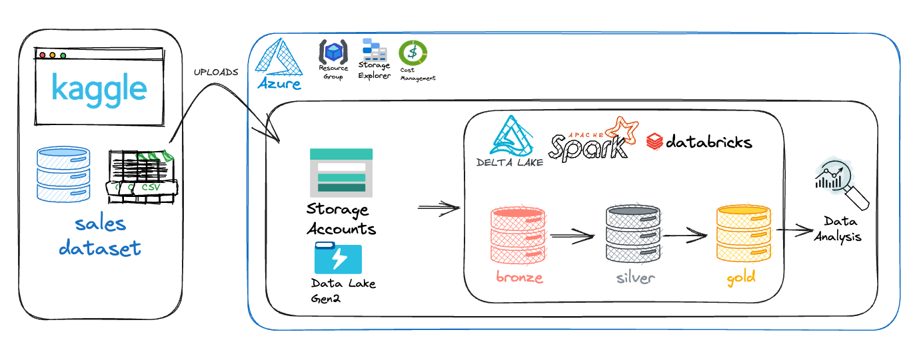

# ECOMMERCE SALES DATASET

### 1. OBJETIVO
O objetivo do desafio é montar uma arquitetura medalhão (bronze, silver,gold) utilizando o databricks, a fonte de dados deve ser um conjunto de dados do Kaggle relacionado à vendas. A disponibilização dos dados da gold devem ser realizadas em formato parquet e delta (aproveitando funcionalidades de versionamento e transações ACID).

Foi realizado também algumas consultas exploratórias diponibilizadas na pasta:

[Analytics](.04/analytics/)

### 2. DATA ARCHITECTURE

### 3. DATASET DIAGRAM

