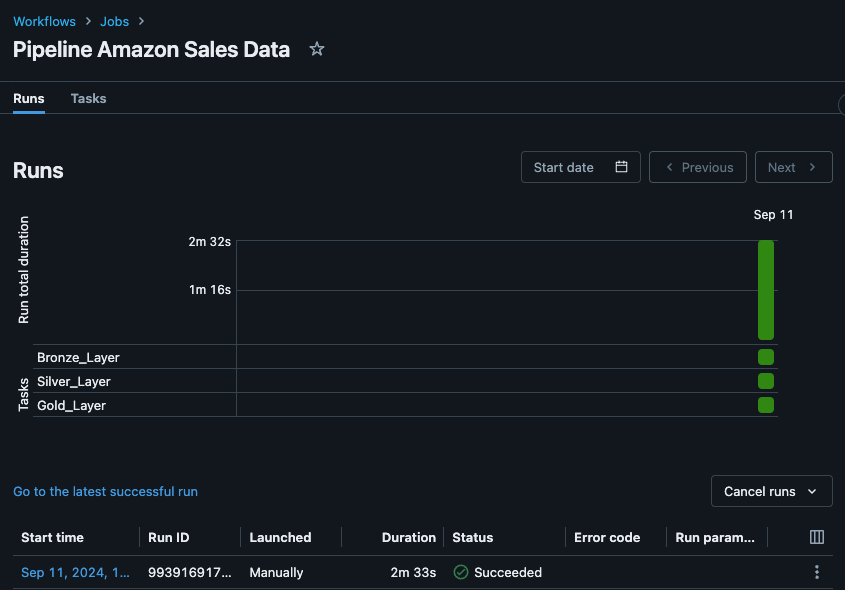
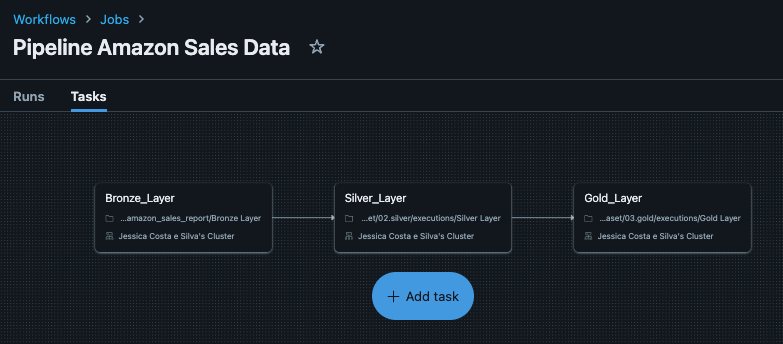
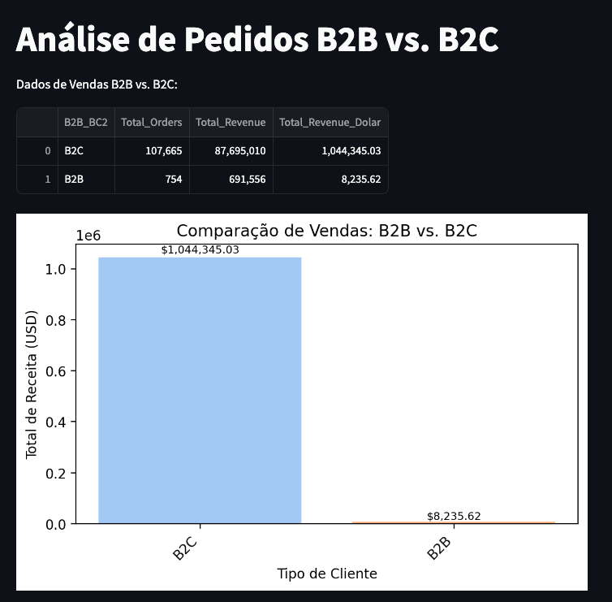
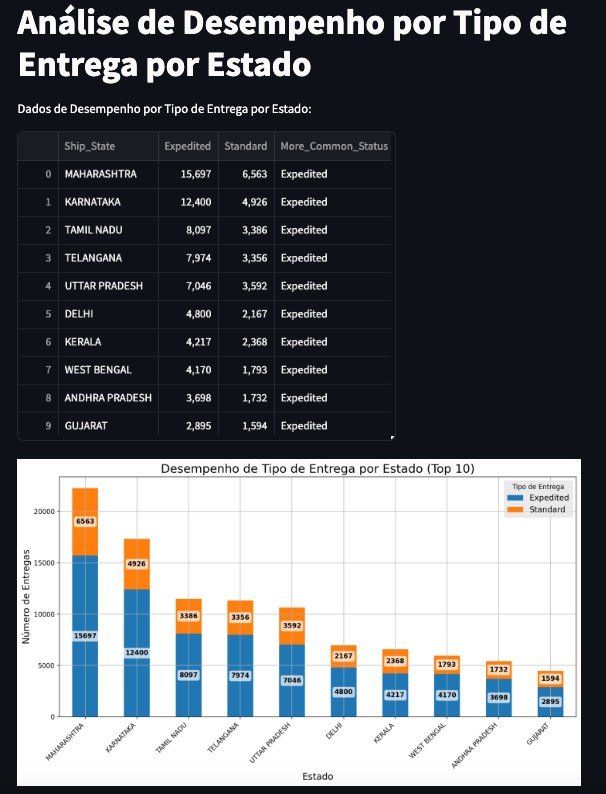

# 📈📊 ECOMMERCE SALES DATASET 🛒 💵

## Sumário

- [OBJETIVO](#1-objetivo)
- [DATA ARCHITECTURE](#2-data-architecture)
- [DATASET DIAGRAM](#3-dataset-diagram)
- [MEDALLION ARCHITECTURE](#4-medallion-architecture)
- [PIPELINE](#5-pipeline)
- [ANALYSIS](#6-analysis)
- [TECH STACK](#7-tech-stack)

### 1. OBJETIVO
O objetivo do desafio é montar uma arquitetura medalhão (bronze, silver,gold) utilizando o databricks, a fonte de dados deve ser um conjunto de dados do Kaggle relacionado à vendas. A disponibilização dos dados da gold devem ser realizadas em formato parquet e delta (aproveitando funcionalidades de versionamento e transações ACID).

A Base de dados utilizada foi a [Ecommerce Sales Dataset no Kaggle](https://www.kaggle.com/datasets/thedevastator/unlock-profits-with-e-commerce-sales-data)

Foi realizado também algumas consultas exploratórias diponibilizadas na pasta:

[Analysis](04.analysis/)

### 2. DATA ARCHITECTURE

### 3. DATASET DIAGRAM

### 4. MEDALLION ARCHITECTURE

#### CAMADA BRONZE
Realizar a ingestão e o tratamento inicial de um arquivo CSV de relatórios de vendas da Amazon, armazenado em um Data Lake no Azure Databricks. Abaixo estão as principais etapas e objetivos:

##### 1. Listagem de Arquivos no Diretório Landing
O comando `%fs ls 'dbfs:/mnt/datalakeeccomerceproject/prod/landing/'` lista os arquivos no diretório de landing onde os dados brutos são inicialmente armazenados. Isso serve como uma verificação para garantir que os arquivos esperados estão disponíveis antes de iniciar o processo de ingestão.

##### 2. Importação de Bibliotecas
O código importa as bibliotecas necessárias, como pyspark.sql.functions para manipulação de dados, pyspark.sql.types para definir o esquema do DataFrame, e delta para trabalhar com o formato Delta Lake.

##### 3. Definição do Esquema do DataFrame
Foi definido um esquema explícito (StructType) para o DataFrame, que mapeia as colunas do CSV para tipos específicos do Spark:

StringType é usado para a maioria das colunas, pois os dados brutos são lidos como texto.
Este esquema garante que os dados sejam carregados corretamente, com cada coluna associada ao tipo de dado apropriado.

##### 4. Leitura do Arquivo CSV
O arquivo CSV é carregado a partir do caminho `dbfs:/mnt/datalakeeccomerceproject/prod/landing/Amazon Sale Report.csv` usando o esquema definido:

spark.read.format("csv"): Especifica que o formato do arquivo de origem é CSV.
.option("header", "true"): Indica que o arquivo CSV contém um cabeçalho.
.schema(df_schema): Aplica o esquema customizado durante a leitura dos dados.

##### 5. Escrita dos Dados no Nível Bronze
Os dados lidos são então escritos no Data Lake como uma tabela no nível bronze, utilizando o formato Delta:

`.write.format("delta").mode("overwrite").save("/mnt/datalakeeccomerceproject/prod/bronze/tb_amz_sales_report")`: Esse comando escreve o DataFrame no formato Delta, sobrescrevendo qualquer dado existente na tabela `tb_amz_sales_report`.

O nível bronze armazena dados brutos com mínimas transformações, servindo como a camada de armazenamento inicial dos dados após a ingestão.

#### CAMADA SILVER

##### 1. Seleção e Renomeação de Colunas
A primeira parte do código seleciona e renomeia colunas da tabela bronze sales_bronze.tb_amz_sales_report para preparar os dados no nível silver. Algumas colunas foram renomeadas para padronização, enquanto outras foram transformadas para garantir a consistência dos dados. Por exemplo:

- index foi renomeado para id.
- A coluna date foi convertida de string para o tipo de data (Order_Date).
- A coluna Status foi renomeada para Order_Status.

##### 2. Tratamento de Valores Nulos e Ajustes Específicos
Em seguida, o código realiza o tratamento de valores nulos utilizando a função coalesce. Esse tratamento é feito para evitar problemas em análises futuras. Colunas como Courier_Status, Currency, Amount, entre outras, foram tratadas para garantir que os valores nulos sejam substituídos por valores padrão, como 'N/A' ou 0.

Além disso, foi adicionada uma coluna Price, que calcula o preço unitário de cada item com base na quantidade (Quantity) e no valor total (Amount).

##### 3. Ajuste de Estados (Ship_State)
Nessa etapa, o código substitui siglas de estados específicos por seus nomes completos, por exemplo:

- 'RJ' foi substituído por 'RAJSHTHAN'.
- 'NL' foi substituído por 'NAGALAND'.

Este ajuste foi feito para garantir a padronização dos dados relacionados aos estados.

##### 4. Escrita dos Dados no Nível Silver
Finalmente, o DataFrame tratado é salvo em um formato Delta no nível silver, substituindo qualquer arquivo existente no caminho especificado. O uso do formato Delta facilita a versionamento dos dados e otimiza as consultas futuras.

#### CAMADA GOLD 

Este notebook no Databricks é projetado para transformar dados de vendas em dimensões e uma tabela de fatos a partir dos dados processados no nível silver. Os dados são então armazenados em duas formas diferentes no nível gold: no formato Delta e Parquet. A seguir, as principais etapas e objetivos do código são explicados.

##### 1. Importação de Bibliotecas
O código começa com a importação da biblioteca pyspark.sql.functions como fn, que fornece funções para manipulação de DataFrames no PySpark.

##### 2. Consulta à Tabela Silver
Uma consulta SQL é executada para visualizar os dados presentes na tabela `sales_silver.tb_amz_sales_report`. Esta tabela silver contém dados processados e limpos, prontos para serem transformados em dimensões e fatos.

##### 3. Criação das Dimensões
São criados vários DataFrames que representam diferentes dimensões, extraindo colunas específicas da tabela silver:

- Dimensão de Pedidos (df_dim_orders): Contém informações relacionadas aos pedidos, como Order_ID, Order_Date, Order_Status, Fulfilment, Sales_Channel, B2B, e Currency.

- Dimensão de Itens (df_dim_itens): Contém informações dos itens, como SKU, Style, Category, Size, ASIN, e Price.

- Dimensão de Envio (df_dim_shipment): Contém dados de envio, incluindo Order_ID, Ship_Status, Ship_City, Ship_State, Ship_Postal_Code, e Ship_Country.

- Dimensão de Entrega (df_dim_delivery): Contém o status de entrega associado ao Order_ID.

##### 4. Criação da Tabela de Fatos
A tabela de fatos (df_fact_transactions) é criada para capturar transações com as seguintes colunas:

- Transaction_ID: Um identificador único para cada transação.
- Order_ID: Associado ao pedido correspondente.
- SKU: Identificador do item.
- Quantity: Quantidade do item na transação.
- Amount: Valor da transação.

##### 5. Escrita dos Dados no Formato Delta
Os DataFrames que representam as dimensões e a tabela de fatos são gravados em um Data Lake no formato Delta. Esse formato oferece vantagens como ACID compliance, histórico de versões dos dados e melhor desempenho em consultas:

Cada dimensão e a tabela de fatos são salvas no diretório `/mnt/datalakeeccomerceproject/prod/gold/` correspondente, utilizando o formato Delta.

##### 6. Escrita dos Dados no Formato Parquet
Além do formato Delta, os mesmos DataFrames são também gravados no formato Parquet:

Esse processo cria uma versão dos dados em um formato leve e eficiente, com compressão colunar, o que facilita consultas rápidas e armazenamento otimizado.

### 5. PIPELINE

##### 1. Pipeline Running with Success

##### 1. Pipeline

### 6. ANALYSIS
- Objetivo: Comparar o desempenho das vendas entre clientes B2B e B2C.

 

 - Objetivo: Avaliar qual a preferência de tipo de entrega escolhido pelos clientes por estado
   

### 7. TECH STACK  

